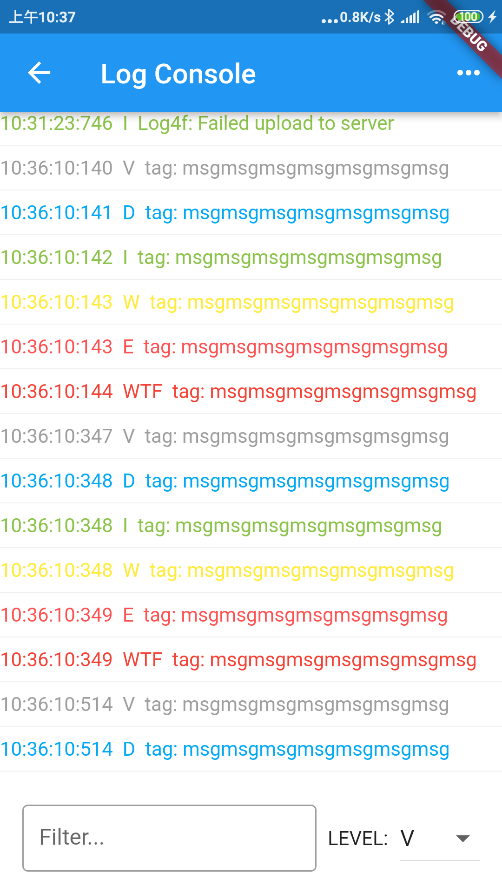
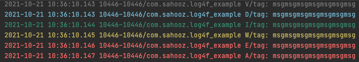
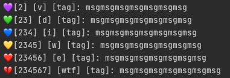
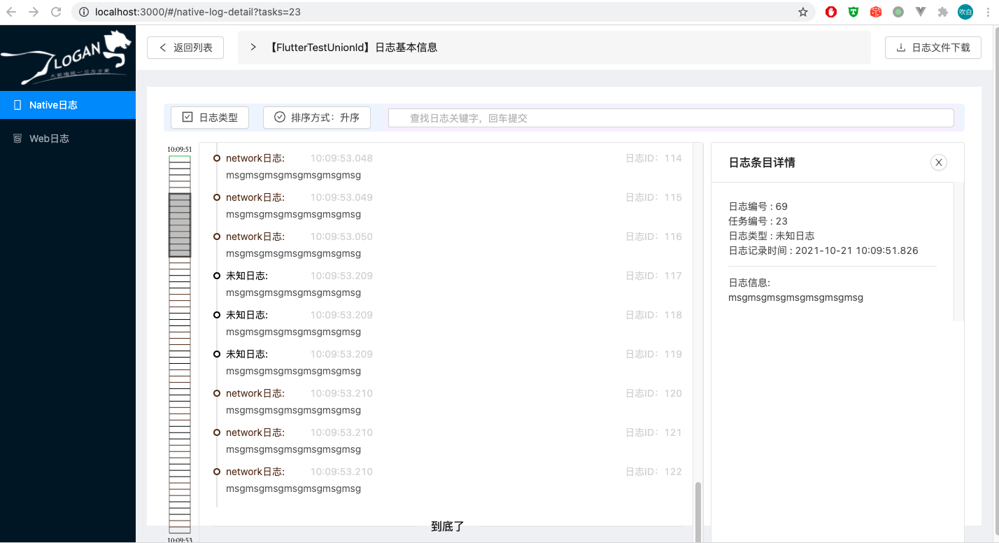

# log4f

Logger for Flutter, inspired by Android logcat

## Base Usage

```dart
Log4f.log("v", "tag", "msgmsgmsgmsgmsgmsgmsg", 0, 0, useLogan);
// or
Log4f.v(tag: "tag", msg: "msgmsgmsgmsgmsgmsgmsg");
```

## LogConsole
```dart
Navigator.of(context).push(MaterialPageRoute(builder: (context) => LogConsole()));
// or use other nav apis
```
screenshot:  
 

you can change the default colors by changing Log4f.colorMap

## Native

Log4f wrap Android logcat and iOS NSLog. Here is what it looks like in Locgcat tool:  



and what it looks like in xcode log console:  

  

I add a number so that if we can filter wannring and above logs by "[2345]"...  
It's stupid, but I didn't find the better way...

## Logan

Log4f use Logan to log to files and server

```dart
useLogan = await FlutterLogan.init("0123456789012345", "0123456789012345", 1024 * 1024 * 10);

...

final today = DateTime.now();
final date = "${today.year.toString()}-${today.month.toString().padLeft(2, '0')}-${today.day.toString().padLeft(2, '0')}";
final bool back = await FlutterLogan.upload(
    'http://192.168.3.46:8080/logan/logan/upload.json',
    date,
    'FlutterTestAppId',
    'FlutterTestUnionId',
    'FlutterTestDeviceId'
);
```  

View by Logan web page:  



## Thanks

Logan: https://github.com/Meituan-Dianping/Logan
